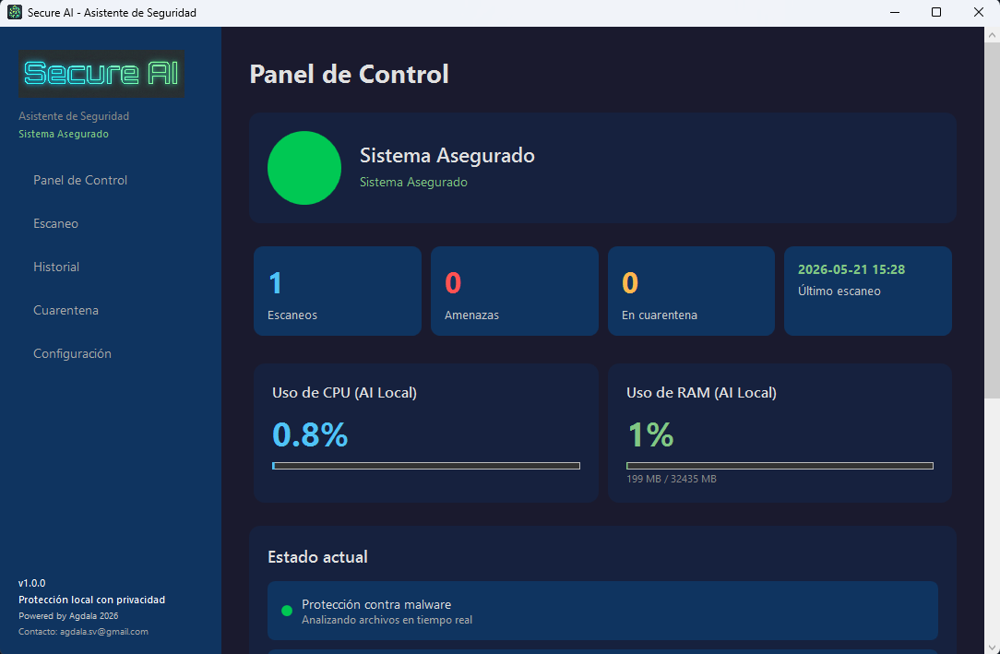
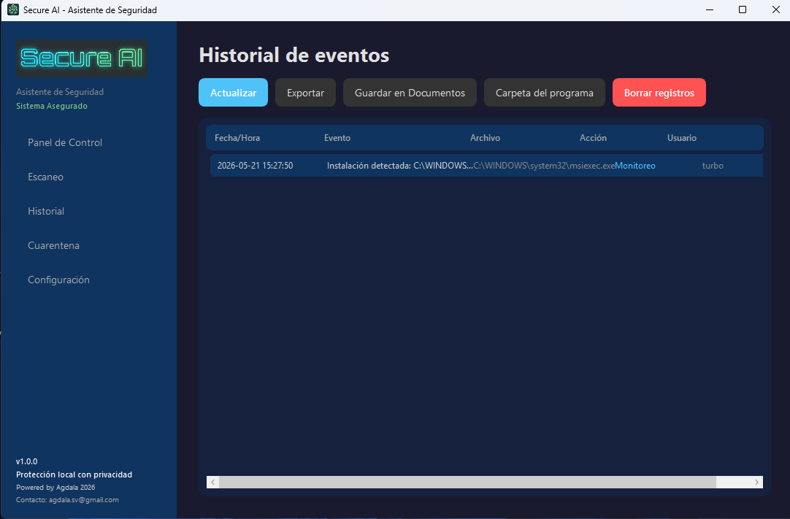
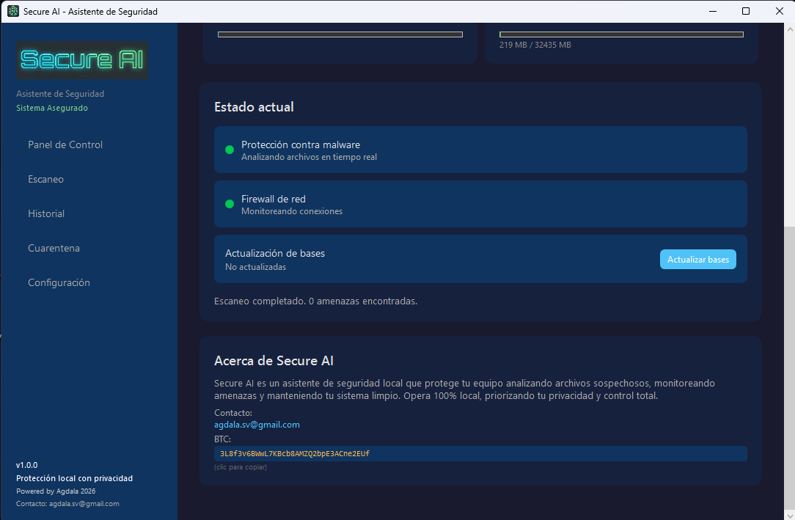
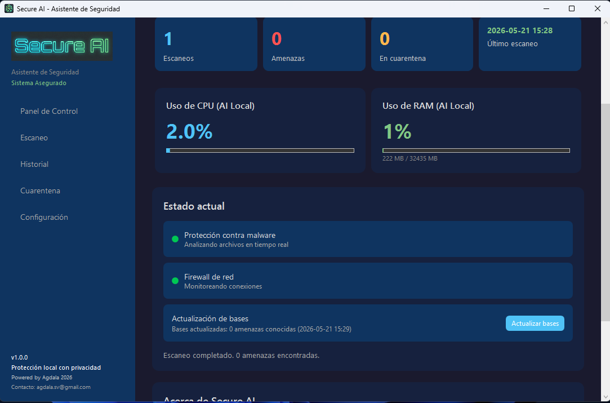

  
  <h1>Secure AI</h1>
  
<strong>Asistente de Seguridad Local para Windows</strong>

  

    
    
    
    
  

   
  <a href="https://agdalasv.github.io/secureai/">🌐 Visitar Sitio Web</a>

---

Secure AI es un asistente de seguridad inteligente que protege tu PC **100% local**. Sin nube, sin telemetría, sin comprometer tu privacidad. Analiza archivos sospechosos, monitorea amenazas de red y mantiene tu sistema limpio.

## 🛡️ Características

### Protección contra Malware
- Escaneo heurístico de archivos por extensiones peligrosas, nombres sospechosos y análisis estructural PE
- Análisis avanzado: entropía, detección de packers, análisis de importaciones API sospechosas
- Escaneo de archivos comprimidos (ZIP bombs, path traversal)
- Detección de esteganografía en imágenes
- Análisis de inyección de scripts
- Cuarentena segura con restauración

### Monitoreo en Tiempo Real
- Vigilancia continua de nuevos procesos, puertos abiertos y cambios en el sistema de archivos
- Detección de ejecución de instaladores
- Escaneo automático de unidades USB al insertarse

### Detección de Amenazas de Red
- Ataques DoS/DDoS por tasa de conexiones
- Escaneo de puertos (SYN flood)
- Puertas traseras (backdoors) en puertos conocidos
- Shells inversas
- Conexiones a servidores C2 y botnets (bases IoC actualizables)
- Túneles DNS
- Desautenticación Wi-Fi
- Conexiones remotas no autorizadas

### Anti-Ransomware
- Monitoreo de directorios sensibles (Escritorio, Documentos, Descargas)
- Detección de extensiones de cifrado conocidas
- Alertas por notas de rescate

### Anti-Rootkit
- Escaneo de controladores del sistema contra lista de rootkits conocidos

### Detección de Persistencia
- Verificación de entradas sospechosas en RUN del Registro de Windows

### Windows Defender Integration
- Consulta de estado de Windows Defender
- Agrega exclusiones para evitar falsos positivos

## ⚡ Secure AI Plus — $3

Adquiere la licencia Plus por **$3 USD** (licencia vitalicia por equipo). Contacta: **agdala.sv@gmail.com**

La versión Plus activa micro-inteligencias artificiales expertas:

| Módulo | Función |
|--------|---------|
| **AI Experta en Malware** | Escaneo de procesos en memoria, detección de ransomware, rootkits y persistencia |
| **AI Experta en Red** | Detección y bloqueo automático de DoS/DDoS, backdoors, shells inversas, C2/botnets |
| **Shadow Helper AI** | 4ª IA sigilosa de apoyo. Analiza memoria, registro, ubicaciones vulnerables y conexiones encubiertas. Se activa bajo demanda cuando la Main AI necesita refuerzos |
| **Escudo de Defensa** | Sistema de 3 niveles de defensa: monitoreo, bloqueo firewall y aislamiento |
| **Escáner USB Automático** | Análisis automático de dispositivos USB al insertarse |

## 🖥️ Capturas

  
  
  
  

## 📦 Requisitos del Sistema

- **Sistema Operativo:** Windows 10 o superior (64 bits)
- **Framework:** .NET 8.0 (incluido en el instalador)
- **Arquitectura:** x64
- **Privilegios:** Administrador (requerido para firewall y Defender)

## 🔧 Tecnologías

- **C# / .NET 8.0** — WPF (Windows Presentation Foundation)
- **MVVM** — Arquitectura Model-View-ViewModel
- **Windows Speech API** — Notificaciones por voz (TTS)
- **WiX Toolset v4** — Instalador MSI
- **PowerShell** — Integración con Defender y Firewall de Windows
- **Threat Intelligence** — Feeds de Abuse.ch, Maltrail, etc.

## 📥 Descargar

Descarga la última versión desde la [página de releases](https://github.com/agdalasv/secureai/releases) o directamente el [instalador MSI](https://github.com/agdalasv/secureai/releases/download/v1.0.0/SecureAI-1.0.0.msi).

## 📬 Contacto

**Correo:** agdala.sv@gmail.com

---

  100% local. Zero telemetry. Zero cloud dependency.

